# Dual-Band Solar LoRa Mesh

Lora-Bridge: Unified Dual-Band (433 and 868 MHz) Solar Node for Meshtastic / Meshcore

[](https://ohwr.org/cern_ohl_s_v2.txt)
[](https://meshtastic.org)
[](https://meshcore.io)
[](#)

---

## Disclaimer

This is a prototype board under development. I take no responsability for its misuse. 

---

## About

**Lora-Bridge** is an open-source, community-driven, solar-powered dual-band LoRa relay node. It merges the elegant architecture design of the **[MASN](https://danielpcostas.dev/masn-a-simple-and-open-source-solar-node-for-meshtastic/)** (Meshtastic Autonomous Solar Node) with a **[Faketec](https://github.com/gargomoma/fakeTec_pcb)-inspired** design and a hardware-integrated **dual-band cross-frequency bridge** system. 

Unlike standard single-frequency nodes, this design bridges the gap between distinct Meshtastic/Meshcore networks by establishing a local hardware **UART bridge** between two dedicated **LoRa** nodes: one operating on **433 MHz (LF)** and the other on **868 MHz (HF)**.

Using this repeater bridge, client nodes can use either frequency to access the network and talk to others in a different frequency without requiring a second node, which improves the scope of communication, as well as the resilience of the network.

---

## Key Features

- **Dual LoRa Modules:** Optimized exclusively around two identical Heltec HT-RA62 Semtech SX1262-based modules (1x Low-Frequency 433 MHz and 1x High-Frequency 868 MHz), ensuring balanced power consumption and identical RF driver logic.
- **Cross-Frequency UART Bridge:** Hardware serial interconnect loop acting as an autonomous cross-band repeater. Packets arriving on 433 MHz are parsed and repeated immediately over 868 MHz, and vice versa.
- **Solar Core Power Path:** Complete MPPT solar charging circuit optimized for high efficiency during low-light winter days, integrated with comprehensive over-current and over-charge protections for Lithium batteries.
- **Low Power Consumption:** The nRF52840 MCU of the promicro / nice!nano boards has a very low power consumption, ideal for a solar design.
- **Sensor Integration and Telemetry:** This design integrates voltage/current sensor for the solar panel, battery and load, as well as enviromental sensor for temperature and humidity inside the enclosure. 
- **User-Friendly Mechanical Design:** Extremely ruggedized layout featuring a specialized chassis and high-clearance placement. Easy to DIY.
- **Minimal RF Internal Interference:** Dedicated isolated internal paths and shielding preventing cross-harmonic desensitization between the co-located 433 MHz and 868 MHz tracks.
- **Modular Design:** this design choice makes it great to test different components in a clean framework.
- **Price:** this PCB is based around easily available and cheap modules.

---

## Motivation and Reasoning

Individual modules are cheap but breadboard-based builds often end up with a jungle of wires, unreliable connections, and an overall setup that easily leads to mistakes.

Anyone approaching LoRa mesh networks usually finds the same thing: tutorials full of tangled wires, tiny solder joints, and boards designed for people with solid electronics experience. That’s discouraging for anyone just getting started — and even more frustrating if your goal is to build a stable solar-powered node for the roof or the field.

This PCB solves this by integrating everything into a single, compact design.

A PCB anyone can assemble in a short amount of time, without microscopes nor messy wiring. The idea isn’t just to make it work, but to help you learn through the process. Building your own node gives you a deeper understanding of the Meshtastic / Meshcore ecosystem and lets you get the most out of it.
 
### Key Advantages
- Uses only THT components, easy to solder.
- Integrates all connections into the board — no messy wiring.
- Accepts standard modules that plug in directly.
- Includes an MPPT solar charger and sensor telemetry features.
- Simplifies maintenance and testing: swap a module without rebuilding the whole node. 

---

## PCB Architecture

### Schematic Diagram

_2026-05-26.png)

#### Interconnection & Bridge Configuration

The cross-frequency bridging architecture utilizes a bidirectional Serial/UART passthrough mechanism between the two nrf52840 modules (nice!nano or promicro). Packets originating from the low-frequency 433 MHz grid are received by the primary nice!nano/HT-RA62-LF, transmitted out its hardware TX pin, and injected natively into the secondary nice!nano/HT-RA62-HF RX pin to be broadcasted to the 868 MHz network.

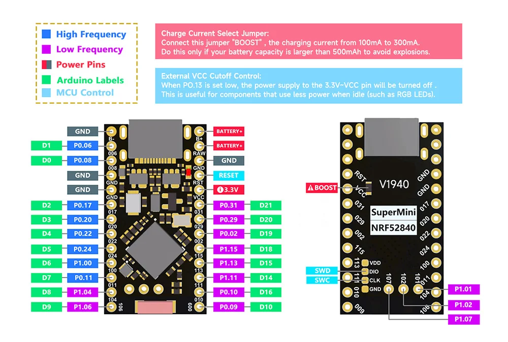

#### UART Pinout Interconnect
To set up the physical **UART-1** bridge between the two nRf52840 modules (promicro or nice!nano), route the cross-over communication as follows:

| Module 1 (433 MHz LF) | Module 2 (868 MHz HF) | Description |
| :--- | :--- | :--- |
| `TX` (Pin 3: P0.08) | `RX` (Pin 2: P0.06) | 433 MHz Traffic to 868 MHz Grid |
| `RX` (Pin 2: P0.06) | `TX` (Pin 3: P0.08) | 868 MHz Traffic to 433 MHz Grid |
| `GND` | `GND` | Common Ground Reference |

### PCB Design and Layout

 

### Dimensions and Mounting

- PCB Size: 65 mm × 120 mm
- Mounting Holes: M2.5

### Ordering the PCB - Gerber File

You can order the PCB directly from **JLCPCB** or PCBWay (the design files are linked below).
Upload the provided files, choose your options, and place the order. 

Download [here](https://github.com/c1ph0r-git/lora-bridge/tree/main/pcb/gerber)

| Part | Qty. | Cost | Source | Notes | 
| :----------- |:--------------|:--------------|:--------------|:--------------|  
| Dual-Band PCB	| 1	| 7€	| [Download](https://github.com/c1ph0r-git/lora-bridge/tree/main/pcb/gerber)	|  |

---

## Hardware Modules

### Modules - Main Components

#### Core:

- MCU: Nice!Nano v2 or ProMicro (**NRF52840**)

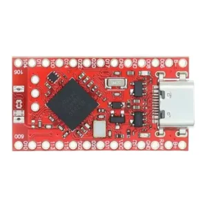 

- LoRa Transceiver modules: **HT-RA62 HF** for 868 MHz and **HT-RA62 LF** for 433 MHz (**SX1262**).

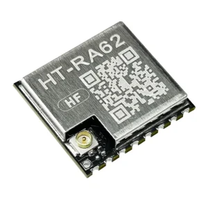

| Part | Qty. | Cost | Source | Notes | 
| :----------- |:--------------|:--------------|:--------------|:--------------|  
| Promicro/NiceNano (NRF52840)	| 2	| 3€	| [AliExpress](https://s.click.aliexpress.com/e/_c3VgzUcP)	| Choose wisely, some have bugs |
| HT-RA62-HF 868 LoRa |	1 |	6,74€ |	[AliExpress](https://s.click.aliexpress.com/e/_c4D8xHEr)	| |
| HT-RA62-LF 433 LoRa |	1 |	7,4€ |	[AliExpress](https://pt.aliexpress.com/item/1005008363549136.html?spm=a2g0o.cart.0.0.58147f06CXfFX1&mp=1&pdp_npi=6%40dis%21EUR%21EUR+15.02%21EUR+7.21%21%21EUR+7.21%21%21%21%402103877917797499637216927e0e47%2112000045246654815%21ct%21PT%21906403403%21%213%210%21&gatewayAdapt=glo2bra)	| |

#### Sensors:
- Current and Voltage Sensor: **INA3221** (three channels). I2C: 0x40: A0 connected to GND (Default)
  - Channel 1 (CH1): nodes & sensors
  - Channel 2 (CH2): output of the MPPT module
  - Channel 3 (CH3): solar panel

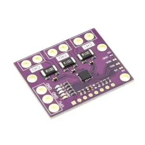 

- Temperature and Humidity Sensor: **BME280** or **BMP280** (cheaper). I2C: 0x76 (Default)

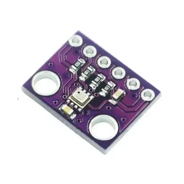 

| Part | Qty. | Cost | Source | Notes | 
| :----------- |:--------------|:--------------|:--------------|:--------------|  
| INA3221 Current Sensor	| 1 |	1,72€ |	[AliExpress](https://s.click.aliexpress.com/e/_c3P3Ae4n)	| Buy the purple one, not the black. New design where all three IN+ pins are NOT connected |
| BMP280 Temperature/Humidity Sensor	| 1	| 0,94€ |	[AliExpress](https://s.click.aliexpress.com/e/_c38NPPoB)	| Choose 6-pin, 3.3 V version |

#### Other PCB assembly components:
- Solar panel and battery on-off switches:
  - SS12D10 Switches

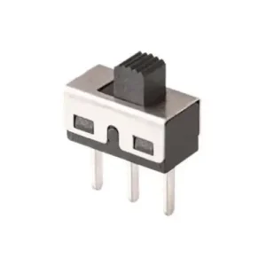 

- User and Reset Buttons:
  - Push Buttons 3×6×5 mm

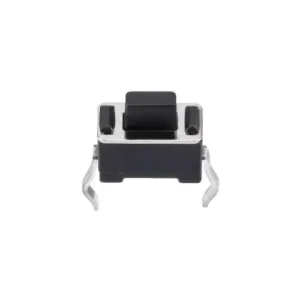 

- Connectors for Solar Panel and Battery: 
  - 2P Screw Terminals for Battery/Solar
  - 2P JST PH 2.0 mm Battery Connector

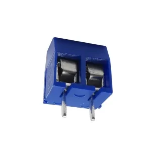 
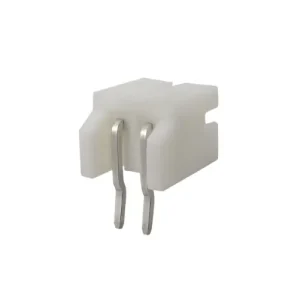 

- Headers: 
  - 40-pin Straight Headers 2.54 mm
  - 40-pin 90° Headers 2.54 mm

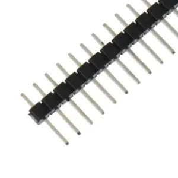 
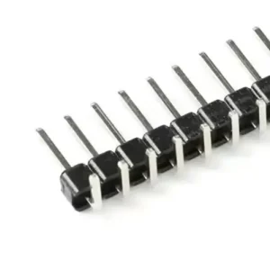

| Part | Qty. | Cost | Source | Notes | 
| :----------- |:--------------|:--------------|:--------------|:--------------|  
| 40-pin Straight Headers 2.54 mm	| 4	| 2,8€	| [AliExpress](https://s.click.aliexpress.com/e/_c3ZB55Dh) | |	
| 40-pin 90° Headers 2.54 mm	| 1	|	0,7€ | [AliExpress](https://s.click.aliexpress.com/e/_c3QkxRBD)	| |
| 2P Screw Terminals for Battery/Solar	| 2	| 1,80€	| [AliExpress](https://s.click.aliexpress.com/e/_c409fyTN) | 	|
| 2P JST PH 2.0 mm Battery Connector	| 1	| 1,62€ |	[AliExpress](https://s.click.aliexpress.com/e/_c3nteeKx) | |	
| SS12D10 Switches	| 2	| 0,99€ |	[AliExpress](https://s.click.aliexpress.com/e/_c3dBUABd) | |	
| Push Buttons 3×6×5 mm	| 4	| 1,8€ |	[AliExpress](https://s.click.aliexpress.com/e/_c4XbWmcn)	| |

### Power:

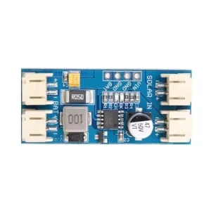 

#### Solar panel:
- 5V Solar Panel: like NIVIAN 9W from Amazon. 
- 1A max current for most chargers
- Theoretical Power Required: 5 Watts (5V times 1A).
- Minimum Practical Panel Rating: 7 Watts (Provides 5W only under perfect, intense midday sun).
- Ideal Panel Rating: 10W to 14W (Ensures reliable 1A charging even in hazy or indirect sunlight).

| Part | Qty. | Cost | Source | Notes | 
| :----------- |:--------------|:--------------|:--------------|:--------------|  
| NIVIAN 9W 5V Solar Panel	| 1	| 20€	| [Amazon](https://www.amazon.es/-/pt/gp/product/B0D6NLJDLZ) |	|

#### Solar Charger:
- Solar Charger: 
    - No MPTT: **TP5000** (switching charger for LiFePO4)
    - Fixed MPPT: **CN3791** (switching charger with Li-ON or LiFePO4 versions) or **CN3065** (linear charger for Li-ON, less current used by the circuit, more efficient in these low power applications)

| Solar Charger Module | Charger Type | Input Voltage Range | Max Charging Current | Solar Panel (Vmp) | Target Battery Chemistry |
| :----------- |:--------------|:--------------|:--------------|:--------------|:--------------|  
| CN3791 (LiFePO4) | Switching | 4.5 - 28V | Up to 4A (Modules usually limit to 2-3A | Specific fixed voltage matching module (6V, 9V, 12V, etc.) | Single-cell LiFePO4 (3.2V nom / 3.6V peak) |
| TP5000 (LiFePO4) | Switching | 4.5 - 9V (7V max) | Up to 2A (Modules default to 1A) | 5V to 6V solar panels | Single-cell LiFePO4 (3.2V nom / 3.6V peak) |
| CN3791 (Li-Ion) | Switching | 4.5 - 28V | Up to 4A (Modules usually limit to 2-3A) | Specific fixed voltage matching module (6V, 9V, 12V, etc.) | Single-cell Li-Ion (3.7V nom / 4.2V peak) | 
| CN3065 (Li-Ion) | Linear | 4.4 - 6V | Up to 1A (Highly heat-restricted) | Strictly 4.5V to 5.5V solar panels | Single-cell Li-Ion (3.7V nom / 4.2V peak) |

| Part | Qty. | Cost | Source | Notes | 
| :----------- |:--------------|:--------------|:--------------|:--------------|  
| MPPT CN3065 Charger	| 1	| 1,60€	| [AliExpress](https://s.click.aliexpress.com/e/_c4FBq1C5)	| elegant choice |
| MPPT CN3791 Charger	| 1	| 2,66€	| [AliExpress](https://s.click.aliexpress.com/e/_c30gOh6P)	| some replicas are faulty  |
| TP5000 Charger	| 1	| 1,60€	| [AliExpress](https://pt.aliexpress.com/item/1005009339731648.html)	| better for LFP batteries. no MPPT |

#### Battery:
- Size: Aim for 6~10,000mAh (~8 days). If the sensors are disabled the battery life can be extended a lot. Conservative calculation [here](https://github.com/c1ph0r-git/lora-bridge/blob/main/battery.md) 
- Chemistry: Prefer LiFePO4 for better heat resistance
- Package: Go with either 18650 size (most used) or 21700 (slightly larger, more capacity, less cells, runs cooler)
- Protection: verify if the battery includes a protection circuit (more expensive) or buy the suggested external circuit
- Choose the battery support accordingly. Please note that protected batteries sometimes do not fit in standard enclosures.

| Part | Qty. | Cost | Source | Notes | 
| :----------- |:--------------|:--------------|:--------------|:--------------|  
| Li-On 18650 Samsung INR18650-35E 3400mAh | 3 | ~9€ | [NKON](https://www.nkon.nl/pt/samsung-inr18650-35e-3400mah-8a-z-tag.html) 
| Li-On 21700 Samsung INR21700-50E 4900mAh - 9.8A | 2 | 6,9€ | [NKON](https://www.nkon.nl/pt/samsung-inr21700-50e.html?gad_source=1&gad_campaignid=23652912424&gbraid=0AAAAAD1QO9g04P4toLP5hj_jOnpLJvxCV&gclid=CjwKCAjw5s_QBhAdEiwADD_gBuJ4lsvDNiuXfjM8iktb3I-3MBCmvP_CPqv2Wldf3MfIbKZ2bOK6GxoCZesQAvD_BwE) | Choose this or other reputable seller; e.g., Samsung 50E in Parallel (1S2P)	 |
| LiFePO4 18650 Haidi HDCF18650 2000mAh - 6A LifePO4 - 3.2V | 4 | 4€ | [NKON](https://www.nkon.nl/pt/rechargeable/lifepo4/hadi-hdcf18650-2000mah-6a-lifepo4-3-2v.html?gad_source=1&gad_campaignid=23652912424&gbraid=0AAAAAD1QO9hnwsJqhWPsc5Uc2zhvoKdkC&gclid=CjwKCAjwidXQBhAZEiwA4egw6P4zMptkk_lApvuTiQ7u2OD_QG35tJ-p2i1sh8t8Hjit5pa9MyQ5mRoCCI8QAvD_BwE) | Better heat resistance |

#### Protection circuit:
- Unprotected batteries should have an overdischarge protection (other protection circuits like overcharge is included in the charger)
- Choose voltage according to battery selection (3.2V for LiFePO4; 3.7V for Li-ON)

#### Charger and Battery Setup Options:

- Li-On:

| Part | Qty. | Cost | Source | Notes | 
| :----------- |:--------------|:--------------|:--------------|:--------------|  
| NIVIAN 9W 5V Solar Panel	| 1	| 20€	| [Amazon](https://www.amazon.es/-/pt/gp/product/B0D6NLJDLZ) |	|
| MPPT CN3065 Charger	| 1	| 1,60€	| [AliExpress](https://s.click.aliexpress.com/e/_c4FBq1C5)	| elegant choice |
| Li-On 18650 Samsung INR18650-35E 3400mAh | 3 | ~9€ | [NKON](https://www.nkon.nl/pt/samsung-inr18650-35e-3400mah-8a-z-tag.html) 
| BMS 1S 3.7V | 1 | 1€ | [AliExpress](https://pt.aliexpress.com/item/1005010481169075.html) | | 
| 18650 Battery support | 1 | 1€ | [AliExpress](https://pt.aliexpress.com/item/1005001955162216.html) | | 

- LiFePO4:

| Part | Qty. | Cost | Source | Notes | 
| :----------- |:--------------|:--------------|:--------------|:--------------|  
| 6V Solar Panel | 1 | ~10-20€ | | |
| CN3791 Charger 6V LiFePO4	| 1	| 2,66€	| [AliExpress](https://s.click.aliexpress.com/e/_c30gOh6P)	| some replicas are faulty  |
| LiFePO4 18650 Haidi HDCF18650 2000mAh - 6A LifePO4 - 3.2V | 4 | 4€ | [NKON](https://www.nkon.nl/pt/rechargeable/lifepo4/hadi-hdcf18650-2000mah-6a-lifepo4-3-2v.html?gad_source=1&gad_campaignid=23652912424&gbraid=0AAAAAD1QO9hnwsJqhWPsc5Uc2zhvoKdkC&gclid=CjwKCAjwidXQBhAZEiwA4egw6P4zMptkk_lApvuTiQ7u2OD_QG35tJ-p2i1sh8t8Hjit5pa9MyQ5mRoCCI8QAvD_BwE) | Better heat resistance |
| BMS 1S 3.2V | 1 | 1€ | [AliExpress](https://pt.aliexpress.com/item/1005010481169075.html) | | 
| 18650 Battery support | 1 | 1€ | [AliExpress](https://pt.aliexpress.com/item/1005001955162216.html) | | 

### Hardware - Other Essencial Components

- Antenna Cables: either UFL/IPX to SMA or IPX to N-Type Female (10cm)
- 433 and 868 MHz Antennas: recommend Ziisor 4.5 dBi 40cm (N-Type) or other 

Antenna and Cable Options:

- N-Type

| Part | Qty. | Cost | Source | Notes | 
| :----------- |:--------------|:--------------|:--------------|:--------------|  
| IPX to N-Type Female (10cm) | 2 | 7,4€ | [AliExpress](https://s.click.aliexpress.com/e/_c4tSgaXn) | 10cm |
| Ziisor 433Mhz 4.5dBi 40cm (N-Type) | 1 | 20€ | [AliExpress](https://s.click.aliexpress.com/e/_c4mnh5ZR) | |
| Ziisor 868Mhz 4.5dBi 40cm (N-Type) | 1 | 20€ | [AliExpress](https://s.click.aliexpress.com/e/_c3misLtn) | | 

- SMA

| Part | Qty. | Cost | Source | Notes | 
| :----------- |:--------------|:--------------|:--------------|:--------------|  
| UFL/IPX to SMA | 2 | 7,5€ | [AliExpress](https://s.click.aliexpress.com/e/_c4ltNPbF) | 10 cm |
| 868MHz Antenna GIZONT 17cm SMA | 1 | 6,65€ | [AliExpress](https://pt.AliExpress.com/item/1005004607615001.html?gatewayAdapt=usa2bra4itemAdapt) | | 
| 433MHz Antenna GIZONT 4dBm SMA | 1 | 6,05€ | [AliExpress](https://pt.aliexpress.com/item/1005005382213254.html?spm=a2g0o.productlist.main.1.39dbsxfssxfsa2&algo_pvid=5ade51c1-efee-4c7c-829c-3de498bfd266&algo_exp_id=5ade51c1-efee-4c7c-829c-3de498bfd266-0&pdp_ext_f=%7B%22order%22%3A%2271%22%2C%22eval%22%3A%221%22%2C%22fromPage%22%3A%22search%22%7D&pdp_npi=6%40dis%21EUR%216.05%216.05%21%21%2146.67%2146.67%21%402103864c17797506007551770e25a3%2112000032827094565%21sea%21PT%21906403403%21X%211%210%21n_tag%3A-29919%3Bd%3Ad60e1a63%3Bm03_new_user%3A-29895&curPageLogUid=W2ixesLj7YaE&utparam-url=scene%3Asearch%7Cquery_from%3A%7Cx_object_id%3A1005005382213254%7C_p_origin_prod%3A) | |

### Hardware - Enclosure

- Weatherproof Electrical Box 158×90×60mm IP65
- Vent Plug M5×0.8-7 IP67
- Cable Gland M12 IP68

| Part | Qty. | Cost | Source | Notes | 
| :----------- |:--------------|:--------------|:--------------|:--------------|  
| Weatherproof Electrical Box 158×90×60mm IP65	| 1	| 5,69€ |	[AliExpress](https://es.aliexpress.com/item/4000623518470.html) | |	
| Vent Plug M5×0.8-7 IP67 |	1	| 2,76€ |	[AliExpress](https://s.click.aliexpress.com/e/_c3Zf1mgR)	| |
| Cable Gland M12 IP68	| 1	| 1,67	| [AliExpress](https://s.click.aliexpress.com/e/_c3XJinZH)	| Fits 3 – 6.5 mm cables |

Great 3D printed alternative:
 - 3D printed design with support for dual antennas at **Printables**
   - [MaxPTMeshBox 196mm](https://www.printables.com/model/1690735-lora-meshcore-meshtastic-solar-repeater-node-196mm)
   - [MaxPTMeshBox 175mm](https://www.printables.com/model/1690729-lora-meshcore-meshtastic-solar-repeater-node-175mm)
 
### Bill of Materials (BOM)

#### All PCB Components (BOM)

Example:
| Part | Qty. | Cost | Source | Notes | 
| :----------- |:--------------|:--------------|:--------------|:--------------|  
| Dual-Band PCB	| 1	| 7€	| [Download](https://github.com/c1ph0r-git/lora-bridge/tree/main/pcb/gerber)	|  |
| Promicro/NiceNano (NRF52840)	| 2	| 3€	| [AliExpress](https://s.click.aliexpress.com/e/_c3VgzUcP)	| Choose wisely, some have bugs |
| HT-RA62-HF 868 LoRa |	1 |	6,74€ |	[AliExpress](https://s.click.aliexpress.com/e/_c4D8xHEr)	| |
| HT-RA62-LF 433 LoRa |	1 |	7,4€ |	[AliExpress](https://pt.aliexpress.com/item/1005008363549136.html?spm=a2g0o.cart.0.0.58147f06CXfFX1&mp=1&pdp_npi=6%40dis%21EUR%21EUR+15.02%21EUR+7.21%21%21EUR+7.21%21%21%21%402103877917797499637216927e0e47%2112000045246654815%21ct%21PT%21906403403%21%213%210%21&gatewayAdapt=glo2bra)	| |
| INA3221 Current Sensor	| 1 |	1,72€ |	[AliExpress](https://s.click.aliexpress.com/e/_c3P3Ae4n)	| Buy the purple one, not the black. New design where all three IN+ pins are NOT connected |
| BMP280 Temperature/Humidity Sensor	| 1	| 0,94€ |	[AliExpress](https://s.click.aliexpress.com/e/_c38NPPoB)	| Choose 6-pin, 3.3 V version |
| 40-pin Straight Headers 2.54 mm	| 4	| 2,8€	| [AliExpress](https://s.click.aliexpress.com/e/_c3ZB55Dh) | |	
| 40-pin 90° Headers 2.54 mm	| 1	|	0,7€ | [AliExpress](https://s.click.aliexpress.com/e/_c3QkxRBD)	| |
| 2P Screw Terminals for Battery/Solar	| 2	| 1,80€	| [AliExpress](https://s.click.aliexpress.com/e/_c409fyTN) | 	|
| 2P JST PH 2.0 mm Battery Connector	| 1	| 1,62€ |	[AliExpress](https://s.click.aliexpress.com/e/_c3nteeKx) | |	
| SS12D10 Switches	| 2	| 0,99€ |	[AliExpress](https://s.click.aliexpress.com/e/_c3dBUABd) | |	
| Push Buttons 3×6×5 mm	| 4	| 1,8€ |	[AliExpress](https://s.click.aliexpress.com/e/_c4XbWmcn)	| |
| MPPT CN3065 Charger	| 1	| 1,60€	| [AliExpress](https://s.click.aliexpress.com/e/_c4FBq1C5)	| elegant choice |
| NIVIAN 9W 5V Solar Panel	| 1	| 20€	| [Amazon](https://www.amazon.es/-/pt/gp/product/B0D6NLJDLZ) |	|
| Li-On 18650 Samsung INR18650-35E 3400mAh | 3-4 | 9~12€ | [NKON](https://www.nkon.nl/pt/samsung-inr18650-35e-3400mah-8a-z-tag.html) 
| BMS 1S 3.7V | 1 | 1€ | [AliExpress](https://pt.aliexpress.com/item/1005010481169075.html) | | 
| Battery support | 1 | 1€ | [AliExpress](https://pt.aliexpress.com/item/1005001955162216.html) | | 
| IPX to N-Type Female (10cm) | 2 | 7,4€ | [AliExpress](https://s.click.aliexpress.com/e/_c4tSgaXn) | 10cm |
| Ziisor 433Mhz 4.5dBi 40cm (N-Type) | 1 | 20€ | [AliExpress](https://s.click.aliexpress.com/e/_c4mnh5ZR) | |
| Ziisor 868Mhz 4.5dBi 40cm (N-Type) | 1 | 20€ | [AliExpress](https://s.click.aliexpress.com/e/_c3misLtn) | | 
| Weatherproof Electrical Box 158×90×60mm IP65	| 1	| 5,69€ |	[AliExpress](https://es.aliexpress.com/item/4000623518470.html) | |	
| Vent Plug M5×0.8-7 IP67 |	1	| 2,76€ |	[AliExpress](https://s.click.aliexpress.com/e/_c3Zf1mgR)	| |
| Cable Gland M12 IP68	| 1	| 1,67	| [AliExpress](https://s.click.aliexpress.com/e/_c3XJinZH)	| Fits 3 – 6.5 mm cables |

### Aproximate Overall Cost

#### 1. Base Costs (Required for both builds)

These items are identical regardless of which antenna configuration you choose.
 - All PCB Components: 39,21 €
 - Other Essential Components (Solar + Batteries): 26,90 €
 - Enclosure Components: 10,12 €
   - Baseline Subtotal: 76,23 €

#### 2. Overall Totals (Based on Antenna Options)

Because the antenna and cable options are mutually exclusive, your final total depends entirely on whether you choose the rugged outdoor N-Type configuration or the more compact/budget-friendly SMA configuration.

##### Option A: High-Gain N-Type Setup (Premium/Outdoor Heavy Duty)
Best suited for permanent outdoor installations requiring robust, weatherproof connections and higher gain.

- Antennas & Cables Cost: €47.40
  - Estimated Total Cost: €123.63

##### Option B: SMA Setup (Budget/Standard)
Best suited for a compact layout or a lower-budget build.

- Antennas & Cables Cost: €20.20
  - Estimated Total Cost: €96.43

#### 💡 Additional Cost Factors to Consider:
- Shipping Fees: Your parts are spread across three different platforms: GitHub/Gerber fabrication (PCBWay/JLCPCB), Amazon, NKON, and multiple stores on AliExpress. Expect an extra €10 – €20 in combined shipping fees.
- AliExpress Choice/Shipping: If you combine the AliExpress items into a single cart, many items might qualify for free "Choice" shipping if you hit their minimum threshold.
- Consumables: This estimate assumes you already have solder, flux, wires, and tools (soldering iron, hot glue/silicone for sealing) on hand.

---

## Setup - Before Assembly!

Before soldering anything, it’s a good idea to make sure the microcontroller works properly and boots without issues. This quick step helps you avoid problems later in the build.

### Check or Update the Bootloader
To install the Meshcore or Meshtastic firmware, your microcontroller must have a bootloader version 0.8 or higher. You can check it by following these steps:

- Connect the NiceNano (NRF52840) board via USB.
- Make two quick touches (using metal tweezers) between the RESET and GND pins (see reference photo below) to enter DFU mode.
- Your computer will mount a USB drive named NICENANO or similar.
- Check that the bootloader version is 0.8 or higher. You can verify this by opening the file INFO_UF2.TXT inside the USB drive that appears when entering DFU mode.
  - If it is inferior, copy the file [update-nice_nano_bootloader-0.9.2_nosd.uf2](https://github.com/adafruit/Adafruit_nRF52_Bootloader/releases/download/0.9.2/update-nice_nano_bootloader-0.9.2_nosd.uf2) into the drive.
  - If you need another version, check the [official repository](https://github.com/adafruit/Adafruit_nRF52_Bootloader).

After copying, the board will automatically reboot (give it a few seconds).
If your board doesn’t include a bootloader, follow the official procedure linked in the [bootloader guide](https://github.com/gargomoma/fakeTec_pcb?tab=readme-ov-file#my-promicro-is-dead-what-can-i-do).

### Install the Firmware

- Enter DFU mode (as explained above).
- Open https://flasher.meshtastic.org or https://meshcore.co.uk/flasher.html. I recommend: [meshcore-lusofw](https://flasher.meshcore.pt/?_gl=1*1oh6xog*_ga*MTEzNDY1MDk0Ni4xNzc5MjI3NDg0*_ga_HF6KDP3ZSV*czE3Nzk3NDUzNjUkbzExJGcxJHQxNzc5NzQ1MzY3JGo1OCRsMCRoMTUwODUzODMxNg..)
- Select the device NRF52 Pro-micro DIY / faketec.
- Choose the latest stable version (or beta if you want to test new features).
- Download the file and drag it into the DFU USB drive.

Once copied, the board will reboot automatically and start running the Meshtastic firmware.
After this process, you’ll know your microcontroller is healthy and ready to integrate into the node.

---

## Assembly & Mechanical Build

PCB Population: Solder the passive solar components onto the main board following the schematic provided. Mount the two HT-RA62 modules into their respective isolated slots.

RF Separation Setup: Ensure that the 433 MHz and 868 MHz external antennas are physically spaced apart at least 50 cm or oriented perpendicular to each other on the external mounting bracket to limit localized desensitization.

### Step by Step Assembly

The physical assembly is straightforward if you follow the right order.
The key is to prepare the modules first, then populate the PCB, and finally connect the antenna and power.

#### Prepare the Modules

Solder the pins to each module: 
- the temperature sensor, 
- the MPPT charger, 
- the microcontroller, and 
- the LoRa radio module.

For the **INA3221**, follow these steps to solder the 90° pins on the channel side and add the SDA bridge.

Step-by-step summary:

1. Using the 90° header pins, cut three groups of three pins
2. Remove the middle pin with tweezers
3. Place the remaining pins in position
4. Trim them so they only make contact with the pad
5. Solder the pins onto the INA3221 channel pads
6. Solder the SDA bridge

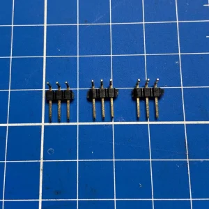 
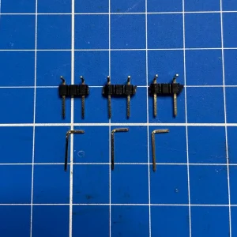 
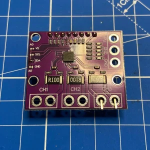 
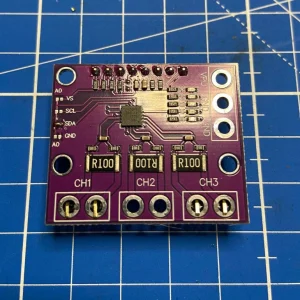 
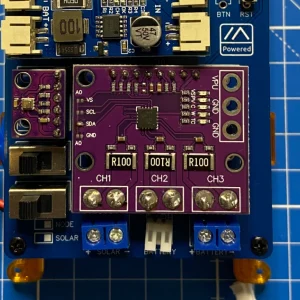 
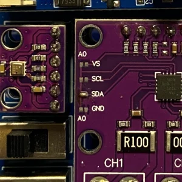 

#### Populate the PCB
Place the modules on the board. You can choose to use female sockets (to make modules swappable) or solder them directly to the PCB.
Add the buttons, switches, and connectors in their positions.

#### Prepare the Solar Panel
Remove any factory electronics (LEDs, regulators, etc.) to avoid unnecessary power drain.
Wire the pair of wires to the terminals and always identify positive and negative — ideally using different wire colors.
Check these notes on [solar panel placement in Portugal](https://github.com/c1ph0r-git/lora-bridge/blob/main/solar_panel.md).

#### Connect Antenna and Power

⚠️ Never power on the node without an antenna connected. You could burn the LoRa module.

- Connect the antenna before powering the system.
- Connect the battery.
- Connect the solar panel (preferably covered while doing so).
- After these steps, your node hardware will be fully assembled and ready for configuration.

---

## Safety and Important Warnings

⚠️ Never power on the node without an antenna connected. You can permanently damage the LoRa module.

⚠️ Do not power the board via USB and solar/battery at the same time. It may damage your computer’s USB port.

⚠️ If soldering header pins on the LoRa module, make sure the antenna connector doesn’t touch pin 1 (RF output). When mounted directly to the PCB as SMD, this issue doesn’t occur.

---

## Basic Configuration
With the hardware ready, it’s time to power up the node (by switching on the toggles) and check that it communicates correctly. For this, we’ll use the Meshtastic or Meshcore app, available for Android and iOS. You can also use the web version if you prefer.

- Connect to the node via Bluetooth using the app (default PIN: 123456).
- Set the region of use and frequency (433 or 868Mhz).
- Assign a new Bluetooth PIN for future connections (and make sure to write it down).
- Give your node a name (4 characters) — this will be its identifier on the mesh network. For Meshcore in Portugal it is highly recommended to use the [online configurator](https://www.meshcore.pt/en/tools/configurator) to select a compatible and standard name to be mapped in Meshcore Portugal. 
- In the Telemetry section, enable Power and Environment. This will start transmitting data such as temperature, pressure, current, and voltage.

After saving the changes, the node will begin sending telemetry and will automatically join the network. From the app, you can now check coverage, neighboring nodes, and power consumption.

### Bridge Firmware Settings

#### Meshtastic Bridge
Both nrf52840 modules must be configured using the Meshtastic CLI or App to allow serial module pass-through framing:
- For Module 1 (433 MHz)
meshtastic --set serial.enabled true --set serial.baud B115200 --set serial.mode TEXTMSG

- For Module 2 (868 MHz)
meshtastic --set serial.enabled true --set serial.baud B115200 --set serial.mode TEXTMSG

#### Meshcore Bridge

| Action | Command | Details | 
| :----------- |:--------------|:--------------|  
| get	| bridge.type	| Shows the configured bridge type (rs232, espnow or none). |
| get/set	| bridge.enabled	| Enables or disables the bridge (on/off). Setting to "on" activates the bridge between the two devices. |
| get/set	| bridge.delay	| Sets the delay in milliseconds for packet transmission through the bridge (valid values: 0-10000 ms). |
| get/set	| bridge.source	| Sets the source of packets to transmit through the bridge. Use "rx" to retransmit received packets or "tx" to retransmit sent packets (logRx or logTx). |
| get/set	| bridge.baud	| Sets the serial transmission speed for the RS232 bridge in baud (valid values: 9600-115200). |

### Remote Control (Remote Admin)
If you plan to leave the node in a remote or hard-to-access location, it’s a good idea to configure it for remote administration. This allows you to change parameters from another node (through the mesh) without needing to plug in a cable or travel to the site.

- Go to the Admin Messages menu and add the private key of one or more of your nodes.
- From that point on, you’ll be able to send configuration commands remotely. These are transmitted as encrypted messages through the mesh network.
- By default, for security reasons, nodes only accept commands via USB, Bluetooth, or TCP.
- When you enable this option, you expand control capabilities — but use it with caution.

Recommendation: test any configuration change on a test node before applying it to a remote one. That way, you avoid locking yourself out or making the node inaccessible.

---

## Status LEDs and Indicators

- INA3221 Current Sensor
  - `VS` ON Power is present on the board.
  - `PV` ON The enabled channels are detecting valid voltage.
  - [More info](https://done.land/components/power/measuringcurrent/viashunt/ina3221/)

- MPPT CN3791 Charger
  - `No light` No sunlight or the panel isn’t providing power.
  - `Solid red` Charging.
  - `Solid blue` Battery fully charged.
  - `Fast red` blinking Battery not detected.
  - More info about the CN3791: [Datasheet](https://www.laskakit.cz/user/related_files/dse-cn3791-2.pdf)

- NRF52840 Microcontroller
  - `Flashing red` The board is powered and running correctly.
  - `Flashing blue` The board is comunicating via bluetooth 
  - Note: some cheap PCBs haves these colors switched around.

--- 

## Outdoor Enclosure
To install the node outdoors, proper protection is essential.
The enclosure must be weatherproof, sun-resistant, and allow for some ventilation to prevent condensation and excessive heat buildup.
Interior temperatures can easily exceed 40 °C under direct sunlight.
The enclosure doesn’t just protect against rain and dust — it’s also key to the node’s long-term durability. Spending a bit of time choosing and preparing it properly will make a big difference in the project’s lifespan.

### Choosing the Enclosure
- Use an IP65 or higher electrical box. This is a common standard and provides enough protection against rain and dust.
- The recommended size is 158×90×60 mm, although it depends on your battery and connector layout.
- Material: PVC or ABS. If possible, choose a UV-resistant version.

### Antenna
- If you want to connect the antenna directly, you can mount the SMA connector on the top and the other on the bottom of the enclosure. 
- However, it is prefered to use an external pigtail (N to N-type, f.e.) to the antenna, to keep the box in a shaded area and decrease internal temperature.
- Bonus: if you have read this far and have issues with interference between 868 and 433MHz or other external sources, check out my [band pass filter](https://github.com/c1ph0r-git/lora-band-pass-filter).

### Connections
- Cable glands: Essential for routing the solar panel cable while keeping the enclosure sealed.
- Vent plug: Prevents condensation buildup and balances internal air pressure.

### Thermal Management
- Painting the enclosure white
- Placing it in partial shade helps reduce heat.
- You can also add a small sun shield or mount it on a mast for natural ventilation.
- Insulate the battery from the wall of the box that gets the most sunlight. You can use a thin foam sheet or a similar spacer. This keeps the battery cooler and extends its lifespan.

---

## Legal Power Limits
Always respect your region’s regulations.
In Europe, the applicable standard is ETSI EN 300-220, which limits the effective radiated power (EIRP). Using an antenna with too much gain could make your node non-compliant or illegal.

### Authorized Frequencies & Limits 

Portugal falls under the European Telecommunications Standards Institute (ETSI) region. The legally permitted frequencies and parameters include:
- `EU863-870 Band` (Primary): The standard band for LoRaWAN in Europe. Frequencies span 863 MHz to 870 MHz.
  - Max Power: Generally limited to **25 mW ERP** (Effective Radiated Power).
  - Duty Cycle: Strictly limited to **1% or 0.1% per channel**, depending on the specific sub-band (e.g., to prevent spectrum congestion).

- `EU433 Band` (Secondary): Frequencies span **433.05 MHz to 434.79 MHz**.
  - Max Power: Typically capped at **10 mW ERP**.
  - Duty Cycle: Limited to **10%**.

In Portugal, deploying a LoRA mesh network falls under the regulatory framework of ANACOM (Autoridade Nacional de Comunicações). Because LoRa operates in unlicensed frequency bands, there is no requirement to obtain an individual radio station license, provided your equipment adheres strictly to the rules governing SRDs (Dispositivos de curta distância / Short Range Devices) outlined in Portugal's QNAF (Quadro Nacional de Atribuição de Frequências).

While Portuguese legislation doesn't explicitly regulate the "mesh" network topology itself, it tightly regulates the radio spectrum and behavior of the devices within that mesh.

#### 1. Core Frequency Bands & Power Limits
Most European and Portuguese LoRa/Mesh deployments operate within the 863–870 MHz bands. According to ANACOM's current SRD decisions (aligned with EU Decision 2019/1345), the primary limits are:

| Frequency Sub-band | Max Output Power (e.r.p.) | Duty Cycle Limit (or Mitigation) | 
| :----------- |:--------------|:--------------|  
| 865.00 – 868.00 MHz | 25 mW (+14 dBm) | 1% duty cycle |
| 868.00 – 868.60 MHz | 25 mW (+14 dBm) | 1% duty cycle (or LBT/AFA spectrum access) | 
| 868.70 – 869.20 MHz | 25 mW (+14 dBm) | 0.1% duty cycle (or LBT/AFA) | 
| 869.40 – 869.65 MHz | 500 mW (+27 dBm) | 10% duty cycle (or LBT/AFA) | 

The 500 mW Exception: The 869.40–869.65 MHz window allows for higher power (500 mW), which is incredibly useful for longer-range backhaul links in a mesh network, but you must respect the stricter 10% duty cycle restriction.

#### 2. The "Mesh" Hurdle: Duty Cycle & LBT
The single biggest legal hurdle for running a LoRa mesh network in Portugal is the Duty Cycle limit.

- The Rule: Standard sub-bands restrict a single radio device to transmitting only 1% of the time (e.g., 36 seconds per hour).

- The Mesh Problem: In a mesh network, central or "router" nodes do not just transmit their own data; they repeat packet traffic for surrounding nodes. In a busy mesh network, a routing node can easily break the 1% legal duty cycle limit.

Legal Workarounds:
To remain strictly compliant with ANACOM guidelines, your mesh nodes must utilize alternative spectrum access techniques if they exceed standard duty cycles:

- LBT (Listen Before Talk): The device scans the channel before transmitting. If the channel is clear, it can transmit.

- AFA (Adaptive Frequency Agility): The device dynamically hops across channels to spread out the transmission load.

If your hardware utilizes a robust implementation of LBT and AFA, the strict 1% time ceiling is legally relaxed under ANACOM's SRD frameworks, preventing your routing nodes from violating the law.

#### 3. CE Marking and Equipment Compliance
Any LoRa equipment (be it an off-the-shelf gateway, a Meshtastic device, or a custom PCB) deployed commercially or publicly in Portugal must comply with the EU Radio Equipment Directive (RED) 2014/53/EU.

- Devices must carry a legitimate CE mark.

- Custom or DIY hardware built for personal, amateur use generally operates in a legal grey area as long as it conforms to the strict SRD power and frequency criteria, but it cannot be sold commercially without full RED certification.

#### 4. Encryption and Privacy Considerations
If your LoRa mesh network is being used to route telemetry, IoT sensor data, or messaging (such as private Meshtastic/Meshcore grids):

- No Open Telecom Rules: Because you are operating on unlicensed spectrum as a private entity or hobbyist, you are generally not classified as a public electronic communications provider under Portugal’s Lei das Comunicações Eletrónicas (LCE).

- GDPR Compliance: If your mesh network transmits personal data (like unencrypted GPS coordinates or identifiable messages) across public spaces, you must ensure compliance with GDPR (RGPD in Portugal), meaning data encryption by default is highly recommended to prevent unauthorized interception.

--- 

## Future Improvements

- [x] Decrease PCB size to a maximum of 100mm
- [x] Include capacitors on LoRa modules and I2C lines
- [x] Include capacitors and resistors on buttons to improve stability (avoid bouncing) and filter noise
- [x] Include diodes to decrease negative current loss
- [x] Include header for tft screen, buzzer, vibrator motor via mosfet circuit to decrease power consumption
- [x] Include a battery maximum discharge protection circuit  

---

## Repository Structure

```
Rep.
├── hardware/
│   ├── pcb/               # KiCad schematics, layout design, and Gerber files  
│   |   ├── schematic      # Schematic diagram
│   |   └── gerber         # Gerber files
│   └── enclosure/         # 3D print files and step files
├── docs/                  # Detailed documentation and RF guidelines
│   ├── components         # Component specification sheets
│   └── other
├── images/                # Graphical resources used in this project
└── README.md              # Project overview
```

## Contributing
Contributions are heavily welcomed! If you are optimizing the RF trace filters for the HT-RA62 or improving the serial bridging packet structure, please feel free to open an Issue or submit a Pull Request.

## License
You are free to copy, modify and distribute this design, provided you maintain identical licensing protections on any derivative works. 
This project is licensed under the CERN Open Hardware Licence Version 2 – Strongly Reciprocal (CERN OHL-S v2). 
See the [LICENSE](https://github.com/c1ph0r-git/lora-bridge/blob/main/LICENSE.txt) file for full conditions.

This project includes several hardware and 3D model files, each with its own license:

### CERN License
The PCB design files are original creations developed and designed for this project. 
These files are licensed under the CERN Open Hardware Licence Version 2 - Strongly Reciprocal (CERN-OHL-S v2).

This license allows you to:
 - Use the hardware design for any purpose
 - Study how the hardware works
 - Modify the design to suit your needs
 - Share copies of the original or modified design

The "Strongly Reciprocal" condition means that if you distribute products based on this design, you must also share any modifications under the same license, ensuring the hardware remains open.

## Acknowledgments
Heavily inspired by Daniel P. Costas' [MASN Node](https://danielpcostas.dev/masn-a-simple-and-open-source-solar-node-for-meshtastic/). 

Bridging architecture concept derived from Meshcore Portugal [(WSL3 Tutorials)](https://www.meshcore.pt/en/docs/tutorials/bridge-wsl3).

Mechanical aesthetics adapted from [Faketec](https://github.com/gargomoma/fakeTec_pcb) node design.

